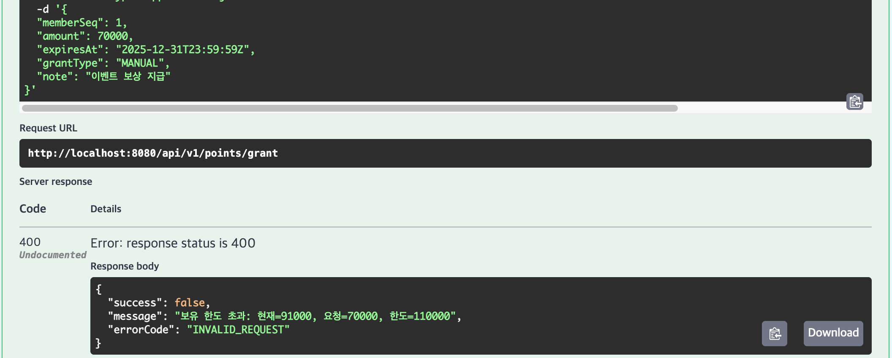
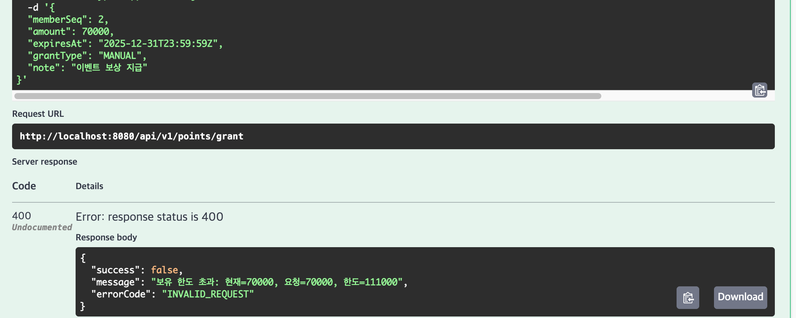
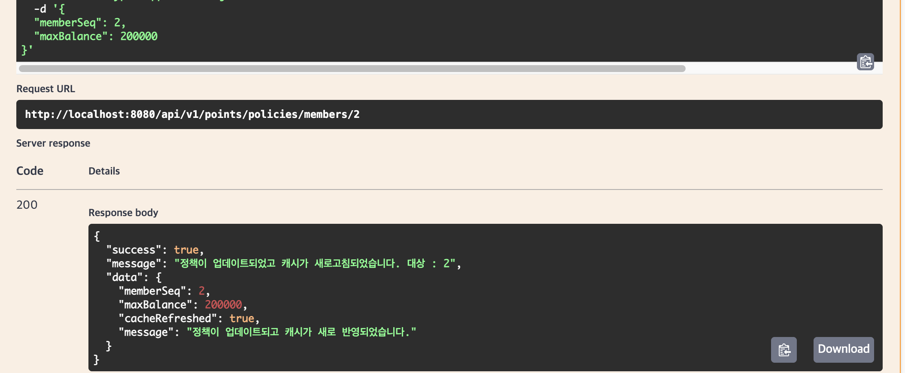
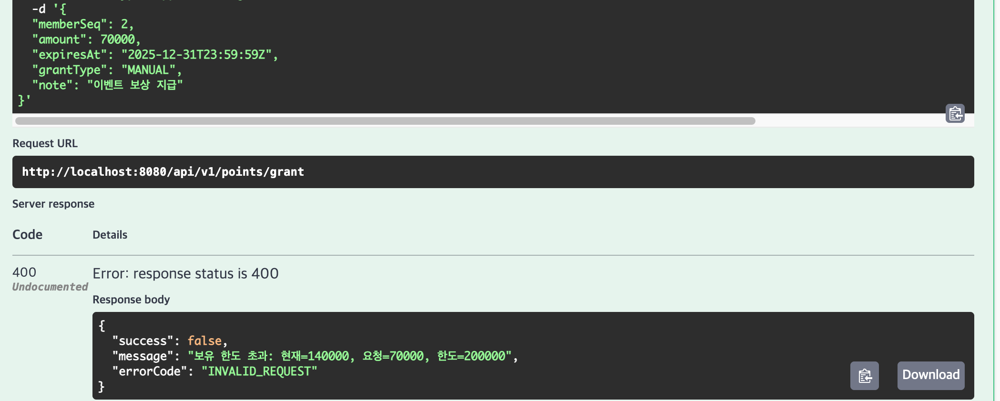

## 테스트 요건
    개인별로 보유 가능한 무료포인트의 최대금액 제한이 존재하며, 하드코딩이 아닌 별도의 방법으로 변경할 수 있어야 한다.

멤버 1, 2의 캐쉬 내역
```json 
"1": {
      "MAX_BALANCE_PER_MEMBER": {
        "scope": "MEMBER",
        "policyType": "MAX_BALANCE_PER_MEMBER",
        "memberSeq": 1,
        "policyValue": 110000,
        "policyId": "25440d8a-ef89-438d-b323-0eebcb99f6f4"
      }
    },
    "2": {
      "MAX_BALANCE_PER_MEMBER": {
        "scope": "MEMBER",
        "policyType": "MAX_BALANCE_PER_MEMBER",
        "memberSeq": 2,
        "policyValue": 111000,
        "policyId": "bfe36651-4690-4adb-aabf-a88597b7f2dc"
      }
    },
```
---

### 멤버 1의 요청내역


### 멤버 2의 요청내역 ( 멤버 1과 한도가 다름 )


### 멤버2의 최대 한도 갱신 ( 111,000 ->200,000 )


### 멤버 2의 최대 한도 갱신 확인

