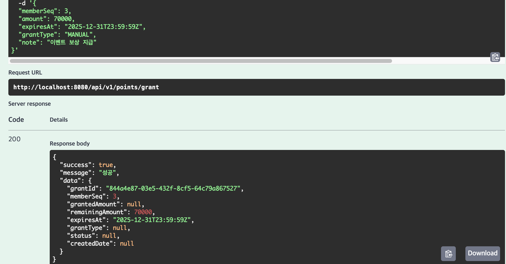
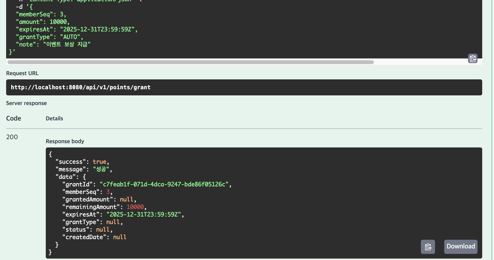
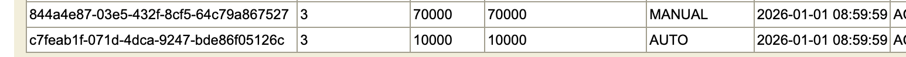

## 테스트 요건

    포인트 적립은 관리자가 수기로 지급할 수 있으며, 수기지급한 포인트는 다른 적립과 구분되어 식별할 수 있어야 한다.
----
#####  (환경)
1. 테스트 용으로 관리자는 수기 입력과 자동 입력을 grantType 받을수 있도록 하였음
2. 멤버는 화면을 통해 포인트 부여를 신청하여 본인의 포인트만 부여할수 있도록 설정함 (소스에서 확인 가능)
3. 테스트를 위해 grantType을 조정하여 테스트함

----

##### 관리자 수기 적립

##### 멤버 적립

##### DB 내역

